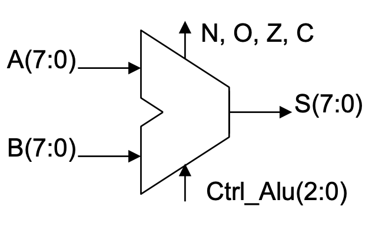
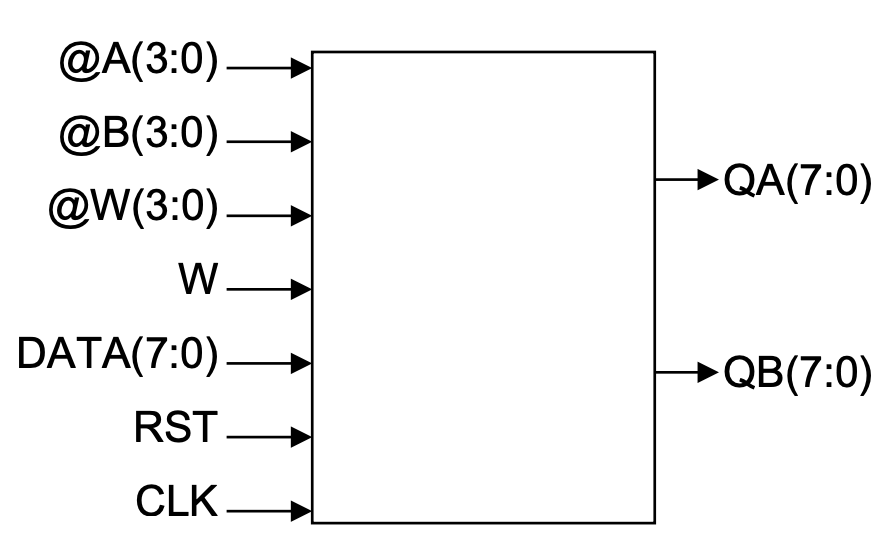
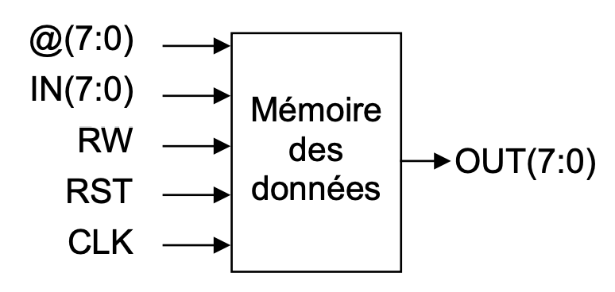
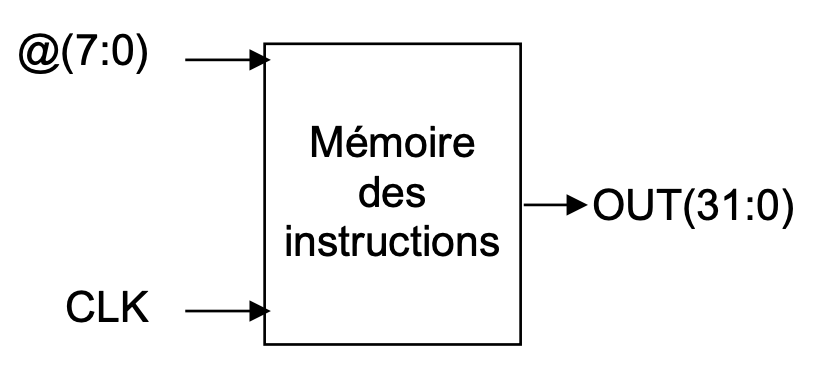

<h1><b>Code des différentes parties du uP développé en VHDL</b></h1>

<h2><u><b>Arithmetic and Logic Unit (ALU)</b></u></h2>
Le code <a href ="ALU/alu.vhd">alu.vhd</a> contient le design associé à l'image ci-dessous : 
</img>

Il permet de réaliser différents types d'opérations sur 8 bits : 
**ARITHMÉTIQUES :** 
> additions  
 soustractions  
 multiplications  

**LOGIQUES :**
> or 
and 
xor 
not 

Cette unité peut activer différents flags : 
> _Carry_ : Dépassement sur l'addition 
> _Negative_ : Valeur négative retournée 
> _Overflow_ : Dépassement sur la multiplication 

<h2><u><b>Banc de registres à double ports de lecture</b></u></h2>
Le code <a href ="banc_de_registres/banc2registres.vhd">banc2registres.vhd</a> contient le design associé à l'image ci-dessous : 
</img>

Il permet de stocker de la donnée dans 16 registres 8 bits.  Il est possible d'écrire 1 valeur dans un registre pour chaque cycle d'horloge, de lire le contenu de 2 registres simultanément et de réinitialiser l'entièreté des registres avec le reset. 

<h2><u><b>Mémoire de données</b></u></h2>
Le code <a href ="memoire_donnees/donnees.vhd">donnees.vhd</a> contient le design associé à l'image ci-dessous : 
</img>

Cette mémoire permet de stocker 256 octets de données, il est possible de lire et d'écrire à l'intérieur.

<h2><u><b>Mémoire d'instructions</b></u></h2>
Le code <a href ="memoire_instructions/instructions.vhd">instructions.vhd</a> contient le design associé à l'image ci-dessous : 
</img>

Cette mémoire permet de stocker 256 instructions encodées sur 32 bits.
